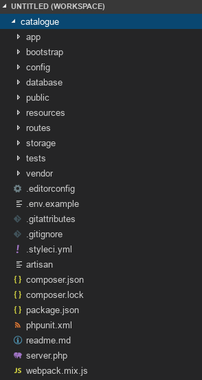
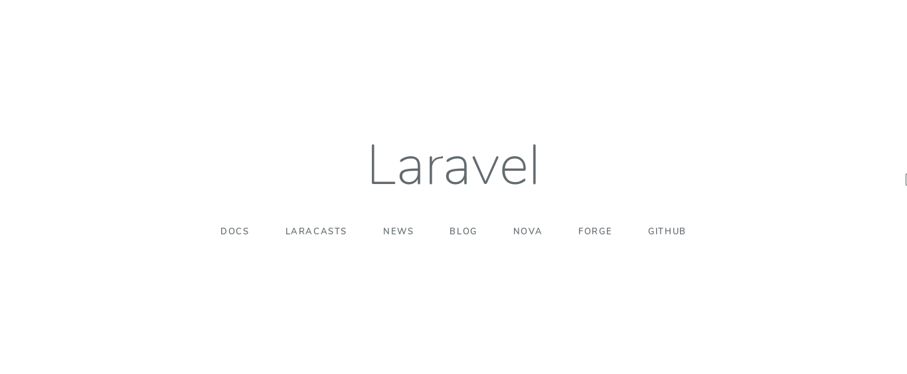
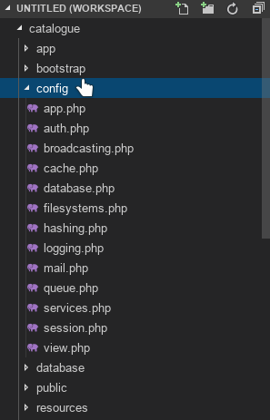
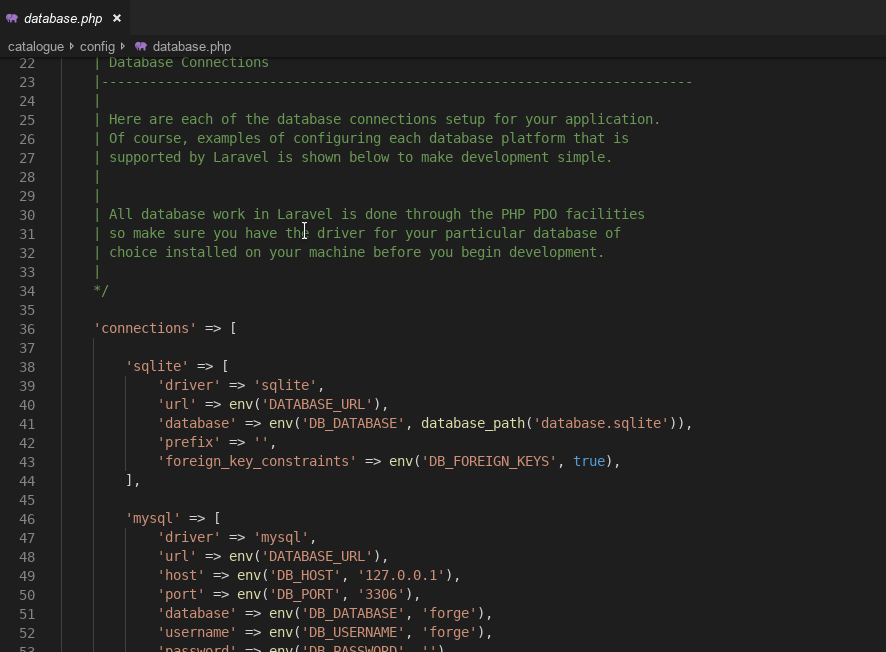
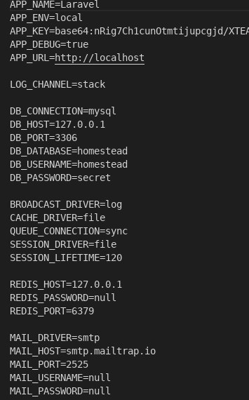

## 1) Introducción:
TODO: hacer algo con esto
Anotaciones:
- https://laravel.com/
- Laravel 5.8.
- Creado el 2011

Características principales de Laravel:
- Open source.
- Orientado a la sintaxis elegante y simple.
- Utiliza el patrón MVC.
- Robusto conjunto de librerías propias y de terceros.
- Sistema de ruteo RESTful.
- Modular y extensible.
- Adopta especificaciones de PHP como PSR-2, PSR-4, PSR-7 y PSR-11.

## 2) Instalación:

Los requisitos de instalación son:
- PHP >= 7.1.3
- BCMath.
- Ctype.
- Json.
- Mbstring.
- OpenSSL.
- PDO.
- Tokenizer.
- XML.

También se necesita el gestor de paquetes **Composer**.

TODO: instalador Centos
```
# Ubuntu
sudo apt install -y composer

# Centos
```


Para iniciar un proyecto en Laravel tienes que ejecutar el siguiente comando:

```
composer create-project --prefer-dist laravel/laravel <nombredelproyecto>
```
Con esto se generará un proyecto base de Laravel en su versión más reciente.

Otra opción para realizar esto es instalar el instalador de Laravel a nivel global:

```
composer global require laravel/installer
```

Luego hay que configurar el PATH para que identifique el instalador como un ejecutable.

TODO: laravel en path

```
laravel new <nombredelproyecto>
```

Con esto obtenemos el mismo resultado que con lo anterior.



Configuramos un nuevo virtual host en Apache.

```
# Ubuntu
cd /etc/apache2/sites-available
sudo touch <nombredelproyecto>.conf
sudo nano <nombredelproyecto>.conf

# Centos
TODO centos
```

Una vez dentro copiamos la configuración que aparece en el **Instructivo Configuración de Ambiente Local**, aunque en las rutas de la aplicación deben indicar la carpeta **/public** del proyecto

```conf
<VirtualHost *:80>
    ServerName proyecto-nuevo.developer.devel
    DocumentRoot /var/www/html/apps/<nombredelproyecto>/public
    <Directory /var/www/html/apps/<nombredelproyecto>/public
        AllowOverride all
    </Directory>
</VirtualHost>
```

Luego debemos levantar el sitio web:

```
# Ubuntu
sudo a2ensite <nombredelproyecto>.conf
sudo service apache2 reload

# Centos
TODO
```

Para finalizar debemos ajustar un par de cosas en Laravel

```
cd /var/www/html/apps/<nombredelproyecto>
cp .env.example .env
php artisan key:generate
chown -R apache:apache storage
```

Hacemos una copia del archivo **.env** para utilizarlo en la configuración del proyecto, también generamos una key para la encriptación de datos. Además asignamos a apache como dueño de la carpeta storage para distintos archivos que utiliza el framework.

Comprobamos visitando la url de la aplicación deberíamos visualizar una imagen como esta:

```
<nombredelproyecto>.<nombredesarrollador>.devel
```




## 3) Configuración:

### Estructura de directorios:

- `/app`: casi toda la programación ocurrirá aquí, dentro se configuran modelos, controladores, comandos, entre otros.
- `/bootstrap`: contiene el archivo `app.php` que carga una instancia de Laravel, también está el directorio `caché` que contiene archivos generados por el framework que mejoran el rendimiento de cosas como rutas y servicios.
- `/config`: como el nombre lo indica contiene archivos de configuración para elementos como base de datos, sesiones, autenticación, entre otros.
- `/dabatase`: contiene migraciones, seeds y factories.
- `/public`: carpeta pública que funciona como método de entrada para las peticiones a la aplicación. Almacena elementos como css, js e imágenes.
- `/resources`: acá ocurre mucha programación relacionada con el front-end, como las vistas, lenguajes, web components y sass.
- `/routes`: como lo indica el nombre, acá se configuran los endpoints para la web, api rest, y web sockets.
- `/storage`: almacenamiento de distintos archivos, como archivos de sesión, logs, vistas compiladas, entre otros.
- `/tests`: se configuran las pruebas, Laravel utiliza la librería PHPUnit.
- `/vendor`: dependencias Composer.

### Carpeta `/config`:



Como se puede apreciar en la imagen, cada uno de estos archivos sirven para configurar distintos aspectos de la aplicación, por ejemplo el archivo `database.php` para configurar distintas conexiones a bases de datos.



Así como este, cada uno de estos archivos se encuentra muy bien documentado. En este caso un array de conexiones define los parámetros básicos para conectar la aplicación con distintos motores de base de datos. Se puede apreciar que se utilizar mucho el helper `env()` que sirve para obtener un parámetro del archivo `.env`.

Se utiliza la librería [vlucas/dotenv](https://github.com/vlucas/phpdotenv) para cargar valores de configuración. El archivo `.env` debe ser asegurado con los permisos correctos y no debe subirse al control de versiones.



## 4) HTTP:

### Routing:

Las rutas en Laravel se configuran dentro del directorio `/routes`. Se utiliza la clase `Route` y sus distintos métodos para definir como se comportan los endpoints de la aplicación.

```php
Route::get($uri, $callback);
Route::post($uri, $callback);
Route::put($uri, $callback);
Route::patch($uri, $callback);
Route::delete($uri, $callback);
Route::options($uri, $callback);
```

La clase `Route` define métodos para los verbos HTTP más comunes. Los parámetros necesarios son `uri` y `callback`.

```php
// ejemplo 1
Route::get('/user', 'UserController@index');

// ejemplo 2
Route::view('/welcome', 'welcome');

// ejemplo 3
Route::get('/user/{id}', 'UserController@get');
```

- Ejemplo 1: cuando visites `<url>/user` se llamará a la función `index` del `UserController`.

- Ejemplo 2: cuando visites `<url>/welcome` automáticamente se cargará la vista `welcome`.

- Ejemplo 3: el valor que venga en `{id}`, se puede pasar como parámetro a la función `get` del `UserController`.

Las rutas se pueden agrupar para dar algunas configuraciones en común.

```php
Route::group(['prefix' => 'posts', 'middleware' => ['midOne', 'midTwo']], function () {
    Route::get('/', 'HomeController@index');
    Route::get('/all', 'PostController@all');
});
```

En el caso anterior se define un grupo con un array de parámetros, `prefix` sirve para definir un prefijo en la ruta, en este caso el valor es *posts*. Por su parte `middleware` define un array de middlewares a ejecutarse antes de la petición. Tanto como para '/' como 'all' aplica ambas configuraciones.

### Controllers:

Ejemplo de un controlador con distintas funciones.

```php
<?php
namespace App\Http\Controllers;

use App\Http\Controllers\Controller;

class UserController extends Controller
{
    /**
     * Show all users.
     * 
     * Route::get('/users', 'UserController@all');
     *
     * @return View
     */
    public function all()
    {
        return view('user.all');
    }

    /**
     * Show the profile for the given user.
     * 
     * Route::get('/users/{id}', 'UserController@show');
     *
     * @param  int  $id
     * @return View
     */
    public function show($id)
    {
        return view('user.profile', ['user' => User::findOrFail($id)]);
    }
}
```

El controlador `UserController` hereda las características de `Controller` que se encuentra en el directorio `app/Http/Controllers/Controller.php` y es aquí donde residen los controladores que necesites.

Para generar un nuevo controlador debes ejecutar:

```
php artisan make:controller UserController
```

Resources Controllers pueden ser creados añadiendo el flag `--resource`. Si añades en el archivo rutas lo siguiente:

```php
Route::resources('users', 'UserController');
```

podrás registrar por defecto un CRUD completo. Puedes omitir algunos elemento de Resources con los métodos `only` y `except`.

En los métodos de los controladores puedes instanciar un objeto `Request` que contendrá mucha información sobre la petición HTTP realizada. Por ejemplo:

```php
public function create(Request $request)
{
    // obtiene el parámetro name enviado en la petición
    $name = $request->input('name');
    $name = $request->name;

    // obtiene todos los parámetros enviados en la petición
    $params = $request->input();
    $params = $request->all();

    // obtiene query string enviado por URL
    $name = $request->query('name');

    // obtiene un array asociativo con los parámetros enviados
    $params = $request->query();

    // array con solo algunos parámetros
    $input = $request->only('name', 'last_name');
    $input = $request->except(['name', 'last_name']);

    // verifica si un parámetro viene en la petición
    echo $request->has('name'); // true/false

    // obtiene cookies
    $cookies = $request->cookie('name');

    // maneja subida de archivos
    $file = $request->file('avatar');
    $file = $request->avatar;

    echo $request->avatar->isValid(); // true/false

    $request->file->store('images');
}
```

Al igual que con las peticiones puedes manejar las respuestas. Un método de un controlador puede devolver vistas, json, texto plano o incluso descargar archivos.

```php
public function getUsers()
{
    // String y Array son parseados automáticamente
    return 'Hello world';
    return [1, 2, 3];

    // respuesta con cabecera (header) y status
    return response('Not found', 404)
        ->header('Content-Type', 'text/plain');

    // adjuntar cookies a respuestas
    return response($content)
        ->cookie('name', 'value', $minutes);

    // redirección
    return redirect('home');

    // redirección a controlador
    return redirect()
        ->action('UserController@index');

    // back
    return back();

    // devuelve una vista
    return view('home');

    // devuelve json con cabecera Content-Type: application/json
    return response()->json($users);

    // descargas
    return response()->download($path);

    // mostrar archivo
    return response()->file($path);
}
```

Las validaciones son muy fáciles de hacer en este punto:

```php
public function create(Request $request)
{
    $this->validate($request, [
        'name' => 'required|string',
        'email' => 'required|email|unique:users',
        'age' => 'required|int|min:18|max:100'
        'birthdate' => 'nullable|date'
    ]);

    // o
    $validator = new Validator::make(
        $request->all(), [
            'name' => 'required|string',
            'email' => 'required|email|unique:users',
            'age' => 'required|int|min:18|max:100'
            'birthdate' => 'nullable|date'
        ]
    );

    // manejar errores
    $errors = $validator->errors();

    echo $errors->first('name');

    foreach ($errors->get('name') as $message) {
        //
    }

    echo $errors->has('name'); // true/false
}
```

### Middlewares:

Basicamente son funciones que se ejecutan antes o despues de una petición HTTP. Pueden servir para validar si el usuario tiene una sesión válida o si es del perfil administrador antes de acceder al recurso en el controlador. Se ubican en `app/Http/Middleware`.

Para crear un middleware:

```
php artisan make:middleware CheckAge
```

Generará un middleware como este, que verifica si la edad ingresada es mayor a 200, de caso contrario es reenviado a `/home`:

```php
<?php

namespace App\Http\Middleware;

use Closure;

class CheckAge
{
    /**
     * Handle an incoming request.
     *
     * @param  \Illuminate\Http\Request  $request
     * @param  \Closure  $next
     * @return mixed
     */
    public function handle($request, Closure $next)
    {
        if ($request->age <= 200) {
            return redirect('home');
        }

        return $next($request);
    }
}
```

Al llamar al método `$next($request)` se pasa la ejecución al siguiente middleware en la lista. Cuando ya no queden middleware se ejecutará el método del controlador.

Para hacer un middleware para después de la petición se puede capturar la respuesta y luego pasar la ejecución:

```php
$response = $next($response);

// realizar acción

return $response;
```

Los middleware se pueden configurar en el archivo `app/Http/Kernel.php`. La clase `Kernel` define como miembros de la clase diferentes array de configuraciones:

- `$middleware`: define los middleware globales, se ejecutan en cada petición.
- `$middlewareGroups`: array que definen grupos de middlewares, por ejemplo:

```php
protected $middlewareGroups = [
        'web' => [
            \App\Http\Middleware\EncryptCookies::class,
            \Illuminate\Session\Middleware\StartSession::class,
            \Illuminate\View\Middleware\ShareErrorsFromSession::class,
            \App\Http\Middleware\VerifyCsrfToken::class,
        ],

        'api' => [
            'throttle:60,1',
            'bindings',
        ],
    ];
```

- `$routeMiddleware`: define alias para registrar nuevos middlewares:

```php
protected $routeMiddleware = [
    'auth' => \App\Http\Middleware\Authenticate::class,
    'auth.basic' => \Illuminate\Auth\Middleware\AuthenticateWithBasicAuth::class,
];
```

- `$middlewarePriority`: define la prioridad y el orden en el que se ejecutan los middlewares.

Para definir que rutas ejecutarán qué middleware tienes varias opciones:

- Rutas: puedes declararlos en las rutas de laravel, `routes/api.php` y `routes/web.php`:

```php
Route::get('/users', 'UserController@index')
    ->middleware('auth')
    ->middleware('another');

Route::group(['middleware' => ['web', 'auth']], function () {
    // definición de rutas...
})
```

- Controladores: puedes declarar también los middlewares en controladores:

```php
<?php

namespace App\Http\Controllers;

use App\Http\Controllers\Controller;

class UserController extends Controller
{
    public function __construct()
    {
        $this->middleware('auth');

        $this->middleware('log')
            ->only('index');

        $this->middleware('guest')
            ->except('logout');

        $this->middleware(function ($request, $next) {
            // lógica del middleware
            return $next($request);
        });
    }
}
```

## 5) Base de datos:

### Introducción:

Antes de comenzar a usar la base de datos hay que configurar un par de cosas en `config/database.php`. Dentro de este se encuentra el array `conections`:

```php
'conections' => [
    'mysql' => [
            'driver' => 'mysql',
            'url' => env('DATABASE_URL'),
            'host' => env('DB_HOST', '127.0.0.1'),
            'port' => env('DB_PORT', '3306'),
            'database' => env('DB_DATABASE', 'forge'),
            'username' => env('DB_USERNAME', 'forge'),
            'password' => env('DB_PASSWORD', ''),
        ],
]
```

Si bien puedes configurar las conexiones que quieras, siempre habrá una por defecto.

Para hacer consultas y trabajar con la base de datos debes hacer uso de la clase `DB`:

```php
public function create(Request $request)
{
    // inserta un nuevo usuario
    DB::table('users')
        ->insert([
            'name' => $request->name,
            'email' => $request->email
        ]);
    
    // utiliza una conexión específica
    $users = DB::connection('mysql')
        ->table('users')
        ->where('age', '>', 18)
        ->get();

    // actualiza registro
    DB::table('users')
        ->where('id', $request->id)
        ->update([
            'name' => $request->name
        ]);

    // elimina registro
    DB::table('users')
        ->where('id', $request->id)
        ->delete();
        
    // transacciones
    DB::transaction(function () {
        DB::table('users')
            ->insert($request->except('permissions'));

        DB::table('user_permissions')
            ->insert($request->permissions);
    });
}
```

### Query builder:

para hacer consultas más avanzadas:

```php
public function get()
{
    // primer elemento que coincide
    $user = DB::table('users')
        ->where('age', '>', 18)
        ->first();

    // buscar por el id 1
    $user = DB::table('users')
        ->find(1);

    // funciones extra de SQL
    $users = DB::table('users')->count();

    $price = DB::table('orders')->max('price');

    $price = DB::table('orders')
        ->where('finalized', 1)
        ->avg('price');

    // verifica si existe o no existe
    echo DB::table('users')
        ->where('id', 1)
        ->exists(); // true/false, puede usarse igual ->doesntExists()

    // select
    $users = DB::table('users')
        ->select('name', 'email as email_address')
        ->all();

    // group y order
    $users = DB::table('users')
        ->orderBy('date', 'asc')
        ->get();

    $users = DB::table('users')
        ->groupBy('date')
        ->all();

    // joins
    $users = DB::table('users')
        ->join(
            'permissions',
            'permissions.user_id',
            '=',
            'users.id'
        )
        ->select(
            'users.name',
            'permissions.files'
        )
        ->get();

    // where
    $users = DB::table('users')
        ->where('votes', '=', 100) // puede ser '=', '<=', '>=', '<>', 'like'
        ->get();

    $users = DB::table('users')
        ->whereBetween('votes', [1, 100])->get();

    $users = DB::table('users')
        ->whereIn('id', [1, 2, 3]) // puede ser ->whereNotInt()
        ->get();

    $users = DB::table('users')
        ->whereMonth('created_at', '12') // puede ser ->whereYear(), ->whereDay(), ->whereDate() o ->whereTime()
        ->get();

    // paginación
    $users = DB::table('users')
        ->paginate(15);
}
```

### Modelos
Los modelos se guardan en la carpeta `/app` y son clases que heredan de `Model`. Se crean con el comando:

```
php artisan make:model Permission
```

```php
<?php

namespace App;

use Illuminate\Database\Eloquent\Model;

class Permission extends Model
{
    // define explícitamente la tabla
    protected $table = 'user_permissions';

    // define explícitamente la llave primaria
    protected $primaryKey = 'permission_id';

    // utiliza timestamps?
    public $timestamps = false;

    // conexión de database por defecto
    protected $connection = 'connection-name';
}
```

Trabajando con modelos

```php
public function get()
{
    $users = Users::all();

    $users = Users::where('age', '>', 18)
        ->get();
}

public function create(Request $request)
{
    $user = new User;
    $user->name = $request->name;
    $user->save();
}
```

### Relaciones:

```php
<?php

namespace App;

use Illuminate\Database\Eloquent\Model;

class User extends Model
{
    /**
     * Get the permission record associated with the user.
     */
    public function permission()
    {
        return $this->hasOne('App\Permission');
    }
}
```

### Migraciones y semillas:

Las migraciones sirven como control de versiones de la base de datos, mientras que las semillas sirven para poblar la base de datos con valores por defecto.

Se encuentra en `database/migrations` y `database/seeds` respectivamente, se pueden generar con:

```
php artisan make:migration create_users_table
php artisan make:seeder UsersTableSeeder
```

Una vez ejecutados tendrás uno de cada uno, el primero es:

```php
<?php

use Illuminate\Support\Facades\Schema;
use Illuminate\Database\Schema\Blueprint;
use Illuminate\Database\Migrations\Migration;

class CreateFlightsTable extends Migration
{
    /**
     * Run the migrations.
     *
     * @return void
     */
    public function up()
    {
        Schema::create('flights', function (Blueprint $table) {
            $table->bigIncrements('id');
            $table->string('name');
            $table->string('airline');
            $table->timestamps();
        });
    }

    /**
     * Reverse the migrations.
     *
     * @return void
     */
    public function down()
    {
        Schema::drop('flights');
    }
}
```

Mientras que la semilla es:

```php
<?php

use Illuminate\Support\Str;
use Illuminate\Database\Seeder;
use Illuminate\Support\Facades\DB;

class DatabaseSeeder extends Seeder
{
    /**
     * Run the database seeds.
     *
     * @return void
     */
    public function run()
    {
        DB::table('users')->insert([
            'name' => Str::random(10),
            'email' => Str::random(10).'@gmail.com',
            'password' => bcrypt('password'),
        ]);
    }
}
```

Ejecutar migraciones:

```
# ejecuta todas las migraciones
php artisan migrate

# rollback
php artisan migrate:rollback

# reset
php artisan migrate:reset
php artisan migrate:reset --seed

```

Ejecutar semillas:

```
# ejecuta todas las semillas configuradas en database/seeds/DatabaseSeeder.php
php artisan db:seed

# ejecuta una semilla en específico
php artisan db:seed --class=UsersTableSeeder
```